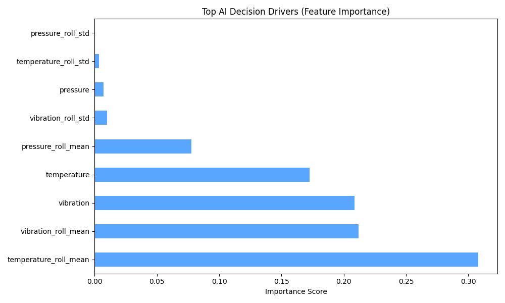
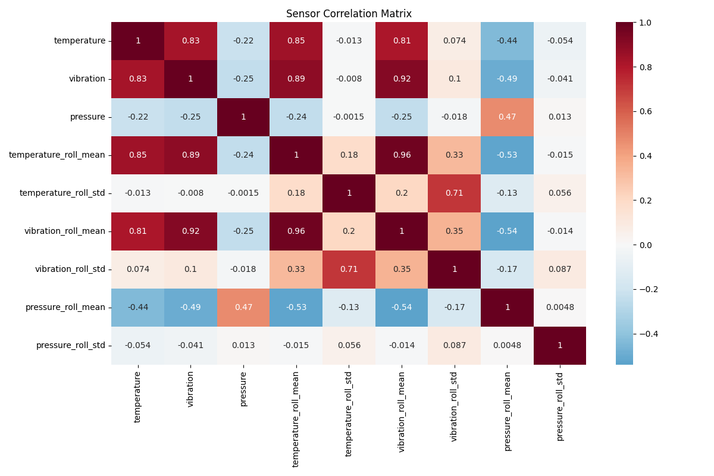
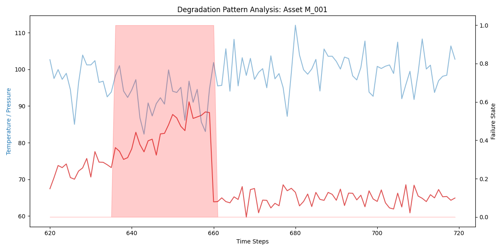

# 🛡️ AI IoT Predictive Maintenance Hub


An industry-grade **Industrial IoT (IIoT) Monitoring System** that leverages Machine Learning to predict equipment failures before they occur. This project transforms raw sensor telemetry into actionable maintenance insights, reducing downtime and operational costs.

---

## 📖 Executive Summary
In modern industrial settings (aviation, manufacturing, energy), reactive maintenance is costly. This system implements **Predictive Maintenance (PdM)** by:
1.  **Ingesting** high-frequency sensor data (Temperature, Vibration, Pressure).
2.  **Engineering** temporal features using rolling window statistics.
3.  **Predicting** failure probabilities using an ensemble Random Forest model.
4.  **Visualizing** fleet-wide health through an interactive real-time dashboard.

### 🎯 Project Objectives
| Objective | Solution |
| :--- | :--- |
| **Data Scarcity** | Real-world synthetic data simulator with degradation modeling. |
| **Failure Detection** | Binary Classification to identify "Critical" vs "Healthy" states. |
| **Explainability** | Feature Importance graphs to identify the "Root Cause" of failures. |
| **Actionability** | Prescriptive maintenance recommendations based on AI outcomes. |

---

## 🚀 Key Features
- 🏭 **Industrial Fleet Overview**: Manage multiple assets (M_001, M_002, etc.) from a single command center.
- 📡 **Live IoT Simulation**: Manually manipulate sensor sliders to see how the AI reacts to anomalies.
- 🧠 **Temporal Feature Engineering**: Automated calculation of rolling means and standard deviations to capture machine wear-and-tear trends.
- 🛠️ **Emergency Intervention**: A "Repair" button that uses session state to simulate asset maintenance and sensor normalization.

---

## 📂 Project Architecture
```text
AI-IoT-Maintenance-Hub/
├── data/               # Raw & Processed time-series records
├── models/             # Trained ML models and feature metadata
├── src/                # Modular ML Pipeline
│   ├── simulator.py    # IoT Telemetry Generator
│   ├── preprocess.py   # Rolling Window Feature Engineering
│   └── train.py        # Model Training & Analytical Plotting
├── dashboard/          # Streamlit UI (Sentinel-AI interface)
├── outputs/            # Rich Analytical Visuals & Performance Reports
├── main.py             # Master Pipeline Trigger
└── requirements.txt    # Project Dependencies
```

---

## 📊 Performance & Analytics
The system generates a suite of analytical outputs to provide deep insights into machine behavior.

### 1. Decision Explainability
We use **Feature Importance** to ensure that maintenance teams understand *why* the AI flagged a machine.


### 2. Failure Pattern Correlation
A study of how vibration and temperature move together during a failure sequence.


### 3. Degradation Analysis
Visualize the **"Red Zone"**—the critical period where machine health begins to deviate from the baseline.


---

## 🛠️ Installation & Usage

1. **Clone & Setup**:
   ```bash
   git clone https://github.com/HarshalNavale45/AI-IoT-Predictive-Maintenance.git
   cd AI-IoT-Predictive-Maintenance
   ```

2. **Install Core Engine**:
   ```bash
   pip install -r requirements.txt
   ```

3. **Train the AI**:
   ```bash
   python main.py
   ```

4. **Launch Command Center**:
   ```bash
   streamlit run dashboard/app.py
   ```

---

## 🎓 Learning Outcomes
- **Signal Processing**: Transforming raw sensor noise into meaningful features.
- **MLOps**: Building a reusable and modular training-to-deployment pipeline.
- **Industrial Dashboarding**: Designing high-contrast UIs for control-room environments.
- **Prescriptive Analytics**: Moving from "What happened?" to "What should we do?".

---
**Developed by Harshal Navale**  
*Showcasing Advanced AI for Industrial IoT*
